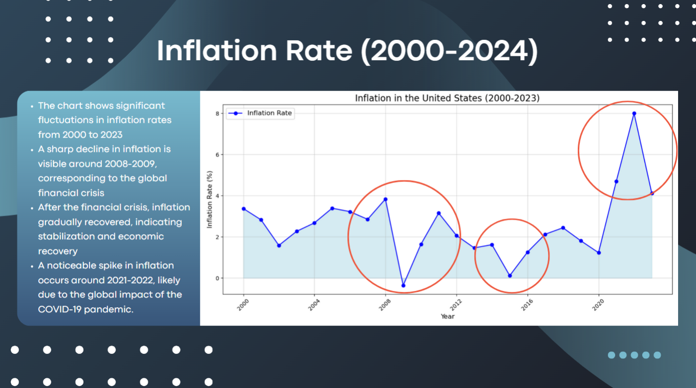
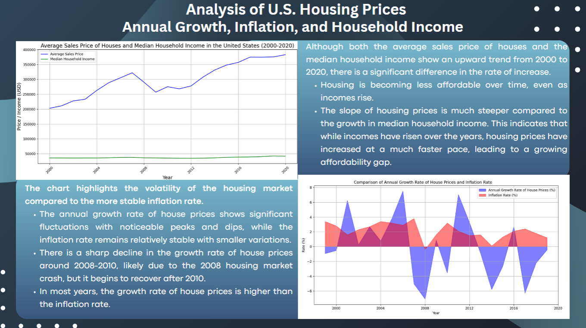
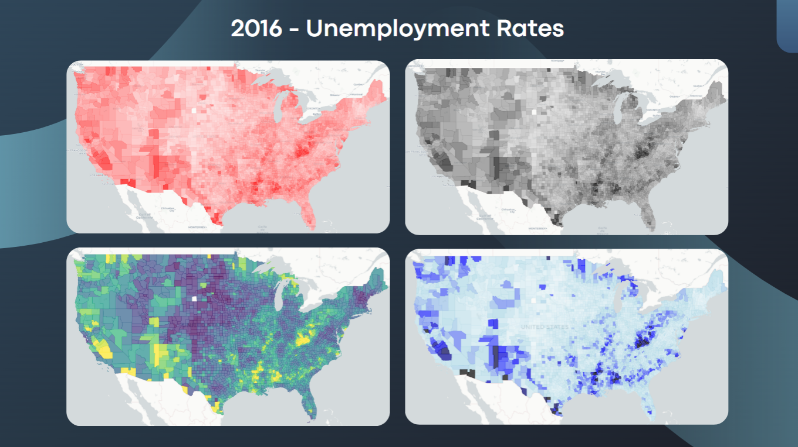
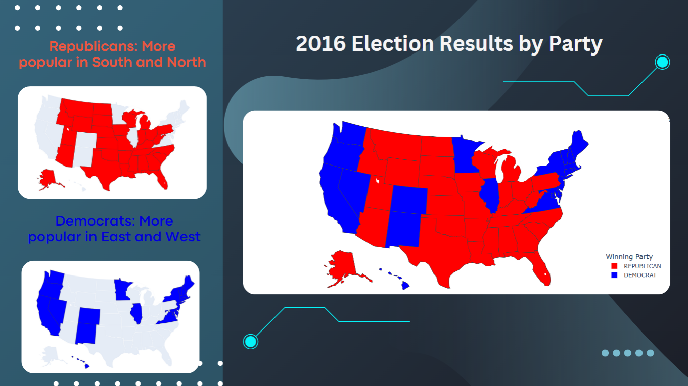
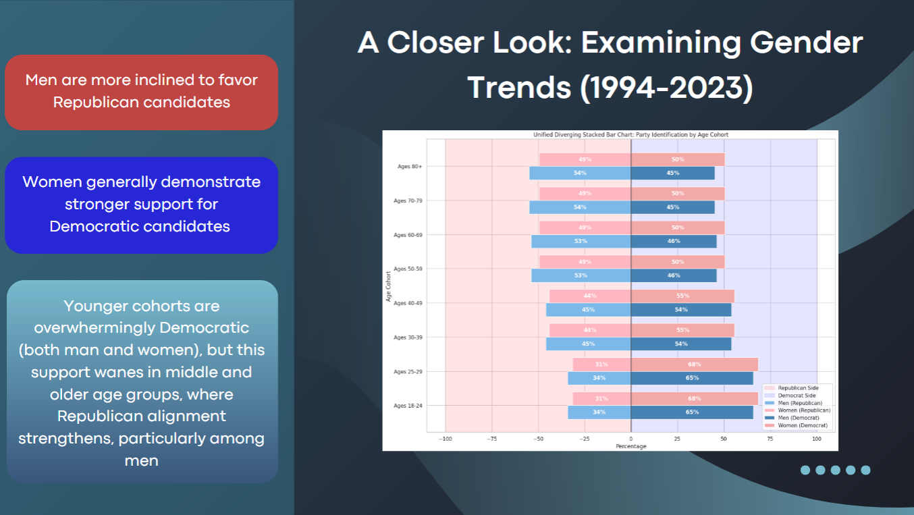
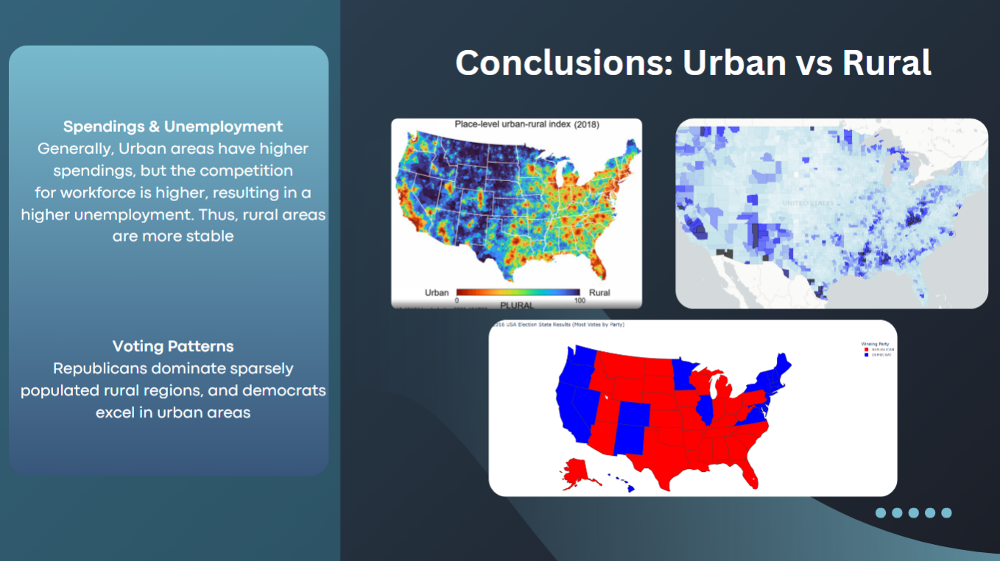

# US Political & Societal Data Visualization

> Analyzing American electoral patterns through economic, political, and social lenses
> 
> Developed by Joel Mattsson, Dumitri Vlad and Alireza Vahedian

## Table of Contents
- [Overview](#-overview)
- [Project Highlights](#-project-highlights)
- [Developed Visualizations](#-developed-visualizations)
- [Key Insights](#-key-insights)
- [Related Projects](#-related-projects)

## Overview

During my exchange studies in Venice, Italy (November 2024 - January 2025), I participated in an advanced data science course focusing on Python programming and data visualization techniques. This repository contains the culmination of that work: a comprehensive analysis of US electoral patterns from 2000-2020.

Our team decomposed American voting behavior into three interconnected dimensions:
- **Economic factors** influencing voter preferences
- **Political trends** across presidential elections
- **Social demographics** and their correlation with party affiliation

## Project Highlights

- **Data Processing**: Leveraged Pandas for cleaning and transforming multiple datasets
- **Advanced Visualization**: Created insightful charts using Matplotlib, Plotly, and Seaborn
- **Statistical Analysis**: Applied numerical techniques to identify significant patterns
- **Multidimensional Approach**: Examined voting behavior through economic, political, and social lenses

The complete project presentation and code are available in the `/submission` directory:
- `Python Boys Presentation.pdf`: Canva presentation with data insights
- `*.ipynb` files: Jupyter notebooks containing all analysis code
- Datasets used for each visualization

## Developed Visualizations

Our analysis produced several revealing visualizations that highlight the complex relationships between various factors and voting patterns:

### Economic Indicators

*Inflation trends and their correlation with election outcomes*

*Annual GDP growth patterns during election cycles*

*Unemployment rates and their electoral implications*

### Political Landscape

*Historical voting patterns across presidential elections*

### Demographic Influences

*Gender-based voting preferences over two decades*

*Geographic distribution of political affiliations*

## My Related Projects

### Jupyter Notebooks
- [Neural Network Image Classification](https://github.com/mrjex/Neural-Network-Image-Classification): *Kaggle notebook using public datasets*
- [Machine Learning Clustering System](https://github.com/mrjex/Machine-Learning-Clustering-System): *Google Colab implementation*

### Python Projects
- [AlgoExpert - My Solutions](https://github.com/mrjex/AlgoExpert): *Algorithm implementations*
- [AWS Sagemaker Prediction](https://github.com/mrjex/AWS-Sagemaker-System): *Cloud-based machine learning*
- [Realtime Change Data Capture Streaming](https://github.com/mrjex/Realtime-Data-Capture-Streaming): *Streaming data pipeline*
- [Global City Streaming](https://github.com/mrjex/Global-City-Streaming): *Multi-dimensional data visualization*
- [AWS BigData Project](https://github.com/mrjex/AWS-BigData-System): *Large-scale data management*
